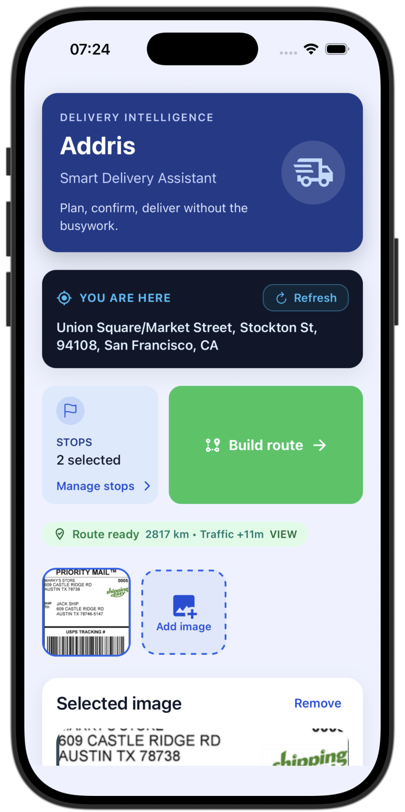
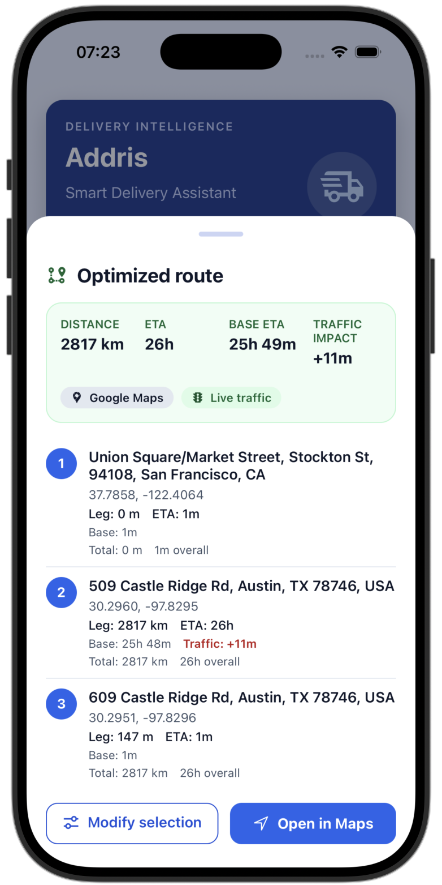

# Addris

Addris is an end-to-end address intelligence platform that extracts addresses from delivery documents and optimizes multi-stop delivery routes. Couriers capture delivery images with the mobile app, and the FastAPI backend processes them using advanced OCR, LLM-based extraction, address parsing, geocoding, and route optimization.

<div align="center" style="display:flex; justify-content:center; gap:24px;">
   
   
</div>

---

## Features

- **Multiple Extraction Strategies**: Supports three extraction methods:
  - **VLM (Vision Language Model)**: Direct image-to-address extraction using multimodal LLMs
  - **OCR + LLM**: OCR text extraction followed by LLM-based address parsing
  - **OCR Sliding Window**: Traditional OCR with sliding window text candidate generation
- **Flexible LLM Integration**: Supports multiple LLM providers (OpenAI, Anthropic, Google, XAI, Ollama/local)
- **Dual OCR Engines**: EasyOCR (default) or Tesseract for text extraction
- **Address Validation**: Libpostal-based parsing with confidence scoring and geocoding validation
- **Route Optimization**: OR-Tools-based TSP solver with Google Maps integration for traffic-aware routing
- **Mobile-First**: Expo React Native app with real-time status updates and navigation handoff

---

## System Architecture

### Workflow

1. **Image Capture**: Mobile app captures or imports delivery document images (JPEG/PNG)
2. **Address Extraction** (backend):
   - **Strategy Selection**: Chooses extraction method based on `ADDRIS_EXTRACTION_STRATEGY` (see [Extraction Strategies](#extraction-strategies) section)
   - **Validation**: Parsed addresses are validated and geocoded to lat/lon coordinates
   - **Confidence Scoring**: Combines OCR/LLM confidence with geocoder feedback
3. **Route Optimization**: Selected addresses are submitted to route optimization endpoint
   - Distance matrix computation (Google Maps API or Haversine fallback)
   - TSP solving with OR-Tools for optimal stop ordering
   - Traffic-aware ETAs and toll cost estimation
4. **Navigation**: Mobile app opens optimized route in Google Maps with waypoints

### Technology Stack

**Backend:**

- FastAPI for async REST API
- EasyOCR/Tesseract for OCR
- LangChain for LLM orchestration
- Libpostal for address parsing
- OR-Tools for route optimization
- Google Maps API / Nominatim for geocoding
- Pydantic for data validation

**Mobile:**

- Expo (React Native) for cross-platform mobile app
- React Query for state management
- Expo Image Picker for camera/gallery access
- Expo Location for GPS and reverse geocoding
- React Native Map Link for navigation handoff

---

## Repository Structure

```
Addris/
├── backend/              # FastAPI backend service
│   ├── app/
│   │   ├── api/         # REST API routers (v1)
│   │   │   ├── routes.py
│   │   │   └── v1/
│   │   │       ├── addresses.py  # Address extraction endpoint
│   │   │       └── routes.py     # Route optimization endpoint
│   │   ├── core/        # Configuration, logging
│   │   ├── domain/      # Domain models (address, geocoding, geometry, optimization)
│   │   ├── schemas/     # Pydantic request/response models
│   │   └── services/   # Business logic (OCR, parsing, geocoding, routing, LLM, storage)
│   │       ├── address_service.py
│   │       ├── ocr.py
│   │       ├── llm.py
│   │       ├── parsing.py
│   │       ├── geocoding.py
│   │       ├── routing.py
│   │       └── storage.py
│   ├── tests/           # Test suite
│   └── pyproject.toml   # Python dependencies
├── mobile/              # Expo React Native mobile app
│   ├── src/
│   │   ├── api/
│   │   │   └── addris.js  # API client
│   │   └── components/   # UI components
│   └── package.json
├── assets/              # Screenshots and images
├── OVERVIEW.md          # Project requirements and goals
└── README.md            # This file
```

---

## Prerequisites

### Backend Requirements

| Component | Requirement    | Installation                                       | Notes                                          |
| --------- | -------------- | -------------------------------------------------- | ---------------------------------------------- |
| Python    | 3.10+          | Managed via [`uv`](https://docs.astral.sh/uv/)     | `uv` automatically downloads Python if missing |
| uv        | Latest         | `curl -LsSf https://astral.sh/uv/install.sh \| sh` | Fast Python package manager                    |
| Libpostal | Native library | macOS: `brew install libpostal`                    | Required for address parsing                   |
| Tesseract | Optional       | macOS: `brew install tesseract`                    | Alternative OCR backend                        |
| libomp    | Optional       | macOS: `brew install libomp`                       | Improves OpenCV performance                    |

### Mobile Requirements

| Component | Requirement | Installation                             | Notes                              |
| --------- | ----------- | ---------------------------------------- | ---------------------------------- |
| Node.js   | 18+         | Use [nvm](https://github.com/nvm-sh/nvm) | `nvm install 18`                   |
| npm       | 9+          | Comes with Node.js                       | Or use `npm install -g npm@latest` |
| Expo CLI  | Optional    | `npm install -g expo`                    | Not required for `npx expo start`  |

### Optional Services

- **Google Maps API Key**: Enables Google geocoding, traffic-aware routing, and toll metadata
- **LLM API Keys**: Required for VLM/OCR+LLM strategies:
  - OpenAI: `ADDRIS_OPENAI_API_KEY`
  - Anthropic: `ADDRIS_ANTHROPIC_API_KEY`
  - Google: `ADDRIS_GOOGLE_API_KEY`
  - XAI: `ADDRIS_XAI_API_KEY`
  - Local (Ollama): No API key needed, set `ADDRIS_LLM_PROVIDER=local`

---

## Quick Start

### Backend Setup

```bash
# Navigate to backend directory
cd backend

# Install dependencies
# On macOS with Homebrew, set compiler flags for libpostal
CFLAGS="-I/opt/homebrew/include" LDFLAGS="-L/opt/homebrew/lib" \
    uv sync

# Create .env file (copy from .env.example)


# Start the FastAPI server
uv run uvicorn app.main:app --reload
```

The API will be available at `http://127.0.0.1:8000`:

- API docs: `http://127.0.0.1:8000/docs` (Swagger UI)
- ReDoc: `http://127.0.0.1:8000/redoc`
- Health check: `http://127.0.0.1:8000/health`

### Mobile App Setup

```bash
# Navigate to mobile directory
cd mobile

# Install dependencies
npm install

# Set backend API URL (adjust if backend runs on different host/port)
export EXPO_PUBLIC_API_URL="http://127.0.0.1:8000"

# Start Expo development server
npx expo start
```

Launch the app in:

- **Expo Go**: Scan QR code with Expo Go app on your phone
- **iOS Simulator**: Press `i` in the terminal (requires Xcode)
- **Android Emulator**: Press `a` in the terminal (requires Android Studio)

---

## Configuration

### Backend Environment Variables

Create a `.env` file in the `backend/` directory with the following variables:

#### Core Settings

| Variable              | Description                                 | Default  | Required |
| --------------------- | ------------------------------------------- | -------- | -------- |
| `ADDRIS_DEBUG`        | Enable verbose logging and request traces   | `false`  | No       |
| `ADDRIS_STORAGE_ROOT` | Directory for uploaded images and artifacts | `./data` | No       |

#### Extraction Strategy

| Variable                     | Description                    | Options                                | Default   |
| ---------------------------- | ------------------------------ | -------------------------------------- | --------- |
| `ADDRIS_EXTRACTION_STRATEGY` | Address extraction method      | `vlm`, `ocr_llm`, `ocr_sliding_window` | `vlm`     |
| `ADDRIS_OCR_BACKEND`         | OCR engine for text extraction | `easyocr`, `tesseract`                 | `easyocr` |

#### LLM Configuration

| Variable                   | Description                        | Default     | Required for VLM/OCR+LLM |
| -------------------------- | ---------------------------------- | ----------- | ------------------------ |
| `ADDRIS_LLM_PROVIDER`      | LLM provider                       | `openai`    | Yes                      |
| `ADDRIS_LLM_MODEL`         | Model name/identifier              | `gemma3:4b` | No                       |
| `ADDRIS_LLM_BASE_URL`      | Custom base URL (for local/Ollama) | `None`      | No                       |
| `ADDRIS_OPENAI_API_KEY`    | OpenAI API key                     | `None`      | If provider=openai       |
| `ADDRIS_ANTHROPIC_API_KEY` | Anthropic API key                  | `None`      | If provider=anthropic    |
| `ADDRIS_GOOGLE_API_KEY`    | Google API key                     | `None`      | If provider=google       |
| `ADDRIS_XAI_API_KEY`       | XAI API key                        | `None`      | If provider=xai          |

#### Geocoding

| Variable                     | Description               | Default           | Required           |
| ---------------------------- | ------------------------- | ----------------- | ------------------ |
| `ADDRIS_GEOCODER_PROVIDER`   | Geocoding service         | `nominatim`       | No                 |
| `ADDRIS_GEOCODER_USER_AGENT` | User agent for Nominatim  | `addris-geocoder` | Yes (Nominatim)    |
| `ADDRIS_GEOCODER_DOMAIN`     | Custom geocoder domain    | `None`            | No                 |
| `ADDRIS_GEOCODER_TIMEOUT`    | Request timeout (seconds) | `10.0`            | No                 |
| `ADDRIS_GOOGLE_MAPS_API_KEY` | Google Maps API key       | `None`            | If provider=google |

#### Routing

| Variable                           | Description               | Default  | Required           |
| ---------------------------------- | ------------------------- | -------- | ------------------ |
| `ADDRIS_ROUTING_DISTANCE_PROVIDER` | Distance matrix provider  | `google` | No                 |
| `ADDRIS_ROUTING_USE_TRAFFIC`       | Enable traffic-aware ETAs | `true`   | No                 |
| `ADDRIS_ROUTING_DISTANCE_TIMEOUT`  | Request timeout (seconds) | `10.0`   | No                 |
| `ADDRIS_GOOGLE_MAPS_API_KEY`       | Google Maps API key       | `None`   | If provider=google |

### Mobile Environment Variables

Set `EXPO_PUBLIC_API_URL` to point to your backend:

```bash
# In shell
export EXPO_PUBLIC_API_URL="http://127.0.0.1:8000"

# Or in .env file (requires expo-constants or similar)
EXPO_PUBLIC_API_URL=http://127.0.0.1:8000
```

See [Expo environment variables documentation](https://docs.expo.dev/guides/environment-variables/) for more details.

---

## Testing

### Backend Tests

```bash
cd backend

# Install dev dependencies (pytest, ruff, mypy)
uv sync --extra dev

# Run all tests
uv run pytest

# Run specific test file
uv run pytest tests/test_address_parser.py
```

The test suite covers:

- Address parsing and validation
- Geocoding helpers
- Route optimization
- Address extraction service
- API endpoints

---

## API Documentation

### Endpoints

#### `POST /v1/addresses/extract`

Extract addresses from an uploaded image.

**Request:**

- Content-Type: `multipart/form-data`
- Body: `image` (file, JPEG or PNG)

**Response:**

```json
{
  "addresses": [
    {
      "raw_text": "123 Main St, Boston, MA 02101",
      "parsed": {
        "house_number": "123",
        "road": "Main St",
        "city": "Boston",
        "state": "MA",
        "postcode": "02101"
      },
      "latitude": 42.3601,
      "longitude": -71.0589,
      "confidence": 0.95,
      "status": "validated",
      "geocode_message": "Successfully geocoded"
    }
  ]
}
```

The extraction strategy is configured via `ADDRIS_EXTRACTION_STRATEGY`. See the [Extraction Strategies](#extraction-strategies) section for details.

#### `POST /v1/routes/`

Compute optimized delivery route.

**Request:**

```json
{
  "origin": {
    "latitude": 42.3601,
    "longitude": -71.0589,
    "label": "Current Location"
  },
  "stops": [
    {
      "latitude": 42.3656,
      "longitude": -71.0096,
      "label": "123 Main St"
    }
  ]
}
```

**Response:**

```json
{
  "route": [
    {
      "order": 0,
      "label": "Current Location",
      "latitude": 42.3601,
      "longitude": -71.0589,
      "distance_meters": 0,
      "eta_seconds": 0
    },
    {
      "order": 1,
      "label": "123 Main St",
      "latitude": 42.3656,
      "longitude": -71.0096,
      "distance_meters": 4500,
      "eta_seconds": 600,
      "has_toll": false
    }
  ],
  "total_distance_meters": 4500,
  "total_eta_seconds": 600,
  "distance_provider": "google",
  "uses_live_traffic": true
}
```

#### `GET /health`

Health check endpoint for monitoring.

**Response:**

```json
{
  "status": "ok"
}
```

### API Documentation

Once the server is running:

- **Swagger UI**: `http://127.0.0.1:8000/docs`
- **ReDoc**: `http://127.0.0.1:8000/redoc`

---

## Extraction Strategies

Addris supports three extraction strategies, each with different strengths:

### 1. VLM (Vision Language Model) - Default

**Best for:** High-quality images, complex layouts, handwritten addresses

- Directly processes images with multimodal LLMs
- No OCR step required
- Best accuracy for complex documents
- Requires LLM API key

**Configuration:**

```bash
ADDRIS_EXTRACTION_STRATEGY=vlm
ADDRIS_LLM_PROVIDER=openai  # or anthropic, google, xai, local
```

### 2. OCR + LLM

**Best for:** Text-heavy documents, multiple addresses per image

- OCR extracts all text from image
- LLM parses addresses from extracted text
- Good balance of accuracy and cost
- Requires LLM API key

**Configuration:**

```bash
ADDRIS_EXTRACTION_STRATEGY=ocr_llm
ADDRIS_OCR_BACKEND=easyocr  # or tesseract
ADDRIS_LLM_PROVIDER=openai
```

### 3. OCR Sliding Window

**Best for:** Simple documents, offline operation, no LLM dependency

- OCR extracts text snippets with confidence scores
- Sliding window generates address candidates
- Libpostal parses and validates addresses
- No LLM required (works offline)

**Configuration:**

```bash
ADDRIS_EXTRACTION_STRATEGY=ocr_sliding_window
ADDRIS_OCR_BACKEND=easyocr  # or tesseract
```

---

## Mobile App Features

The Expo React Native app provides:

- **Image Capture**: Camera and photo library access
- **Real-time Status**: Live updates on extraction and routing progress
- **Address Selection**: Toggle addresses on/off for route optimization
- **Location Services**: GPS-based current location with reverse geocoding
- **Route Visualization**: View optimized route with distance, ETA, and toll information
- **Navigation Handoff**: Open route in Google Maps with waypoints

---

## Development

See the [Repository Structure](#repository-structure) section for the project layout.

### Adding New Features

1. **Backend**: Add new endpoints in `api/v1/`, implement services in `services/`
2. **Mobile**: Add components in `src/components/`, update API client in `src/api/`
3. **Tests**: Add tests in `backend/tests/` following existing patterns

### Logging

Structured logging is enabled by default. Set `ADDRIS_DEBUG=true` for verbose request traces and detailed error information.

---

## License

This project is part of a course assignment.

---

## Contributing

This is an academic project. For questions or issues, please create an issue.
